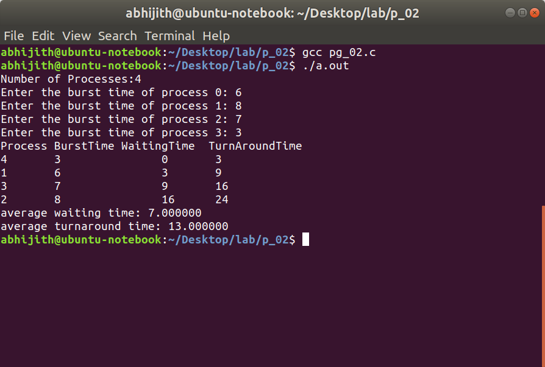

## Shortest Job First (or SJF) scheduling

Shortest job first (SJF) or shortest job next, is a scheduling policy that selects the waiting process with the smallest execution time to execute next. SJN is a non-preemptive algorithm.

- Shortest Job first has the advantage of having minimum average waiting time among all scheduling algorithms.
- It is a Greedy Algorithm.
- It may cause starvation if shorter processes keep coming. This problem can be solved using the concept of aging.
- It is practically infeasible as Operating System may not know burst time and therefore may not sort them. While it is not possible to predict execution time, several methods can be used to estimate the execution time for a job, such as a weighted average of previous execution times. SJF can be used in specialized environments where accurate estimates of running time are available.

Algorithm:

1- Sort all the processes(process ID too) in increasing order according to burst time.
2- Then simply, apply FCFS.

Terms

1. Completion Time: Time at which process completes its execution.

2. Turn Around Time: Time Difference between completion time and arrival time. 
    - Turn Around Time = Completion Time – Arrival Time

3. Waiting Time(W.T): Time Difference between turn around time and burst time.
    - Waiting Time = Turn Around Time – Burst Time

Output

