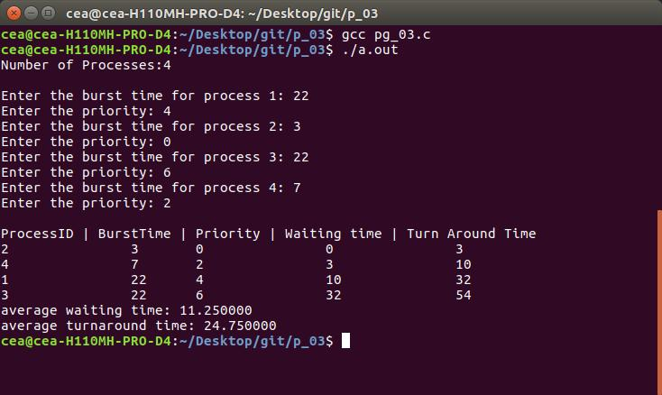

## Program for Priority Scheduling

Priority scheduling is a non-preemptive algorithm and one of the most common scheduling algorithms in batch systems. 
- Each process is assigned a priority. Process with the highest priority is to be executed first and so on.
- Processes with the same priority are executed on first come first served basis. 
- Priority can be decided based on memory requirements, time requirements or any other resource requirement.

Implementation :

1- First input the processes with their burst time 
   and priority.

2- Sort the processes, burst time and priority
   according to the priority.

3- Now simply apply FCFS algorithm.

### [Solution](https://raw.githubusercontent.com/abhijithvijayan/System-Software-lab/master/p_03/pg_03.c)    

Output

