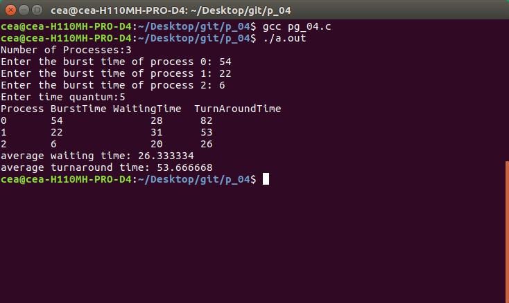

## Program for Round Robin scheduling

Round Robin is a CPU scheduling algorithm where each process is assigned a fixed time slot in a cyclic way.

- It is simple, easy to implement, and starvation-free as all processes get fair share of CPU.
- One of the most commonly used technique in CPU scheduling as a core.
- It is preemptive as processes are assigned CPU only for a fixed slice of time at most.
- The disadvantage of it is more overhead of context switching.

Here we are considering that arrival time for all processes is 0.

### Terms

- Completion Time: Time at which process completes its execution.
- Turn Around Time: Time Difference between completion time and arrival time.
    - Turn Around Time = Completion Time – Arrival Time
- Waiting Time(W.T): Time Difference between turn around time and burst time.
    - Waiting Time = Turn Around Time – Burst Time

The tricky part is to compute waiting times. Once waiting times are computed, turn around times can be quickly computed.

### Steps to find waiting times of all processes:

1- Create an array rem_bt[] to keep track of remaining
   burst time of processes. This array is initially a 
   copy of bt[] (burst times array)

2- Create another array wt[] to store waiting times
   of processes. Initialize this array as 0.

3- Initialize time : t = 0

4- Keep traversing the all processes while all processes
   are not done. Do following for i'th process if it is
   not done yet.

    a- If rem_bt[i] > quantum
       (i)  t = t + quantum
       (ii) bt_rem[i] -= quantum;
    c- Else // Last cycle for this process
       (i)  t = t + bt_rem[i];
       (ii) wt[i] = t - bt[i]
       (ii) bt_rem[i] = 0; // This process is over

Once we have waiting times, we can compute turn around time tat[i] of a process as sum of waiting and burst times, i.e., wt[i] + bt[i]

### [Solution 1](https://raw.githubusercontent.com/abhijithvijayan/System-Software-lab/master/p_04/pg_04.c)

Output:

