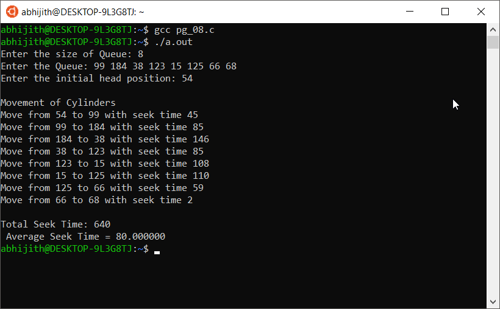

## Program for FCFS Disk Scheduling

Disk scheduling is is done by operating systems to schedule I/O requests arriving for disk. Disk scheduling is also known as I/O scheduling.

Disk scheduling is important because:

- Multiple I/O requests may arrive by different processes and only one I/O request can be served at a time by disk controller. Thus other I/O requests need to wait in waiting queue and need to be scheduled.
- Two or more request may be far from each other so can result in greater disk arm movement.
- Hard drives are one of the slowest parts of computer system and thus need to be accessed in an efficient manner.

There are many Disk Scheduling Algorithms but before discussing them let’s have a quick look at some of the important terms:

- Seek Time: Seek time is the time taken to locate the disk arm to a specified track where the data is to be read or write. 
    - So the disk scheduling algorithm that gives minimum average seek time is better.
- Rotational Latency: Rotational Latency is the time taken by the desired sector of disk to rotate into a position so that it can access the read/write heads. 
    - So the disk scheduling algorithm that gives minimum rotational latency is better.
- Transfer Time: Transfer time is the time to transfer the data. It depends on the rotating speed of the disk and number of bytes to be transferred.
- Disk Access Time = Seek Time + Rotational Latency + Transfer Time
- Disk Response Time: Response Time is the average of time spent by a request waiting to perform its I/O operation. 
    - Average Response time is the response time of the all requests. 
    - Variance Response Time is measure of how individual request are serviced with respect to average response time. 
    - So the disk scheduling algorithm that gives minimum variance response time is better.

### FCFS: 
FCFS is the simplest of all the Disk Scheduling Algorithms. In FCFS, the requests are addressed in the order they arrive in the disk queue.

Advantages:

- Every request gets a fair chance
- No indefinite postponement

Disadvantages:

- Does not try to optimize seek time
- May not provide the best possible service

Output

